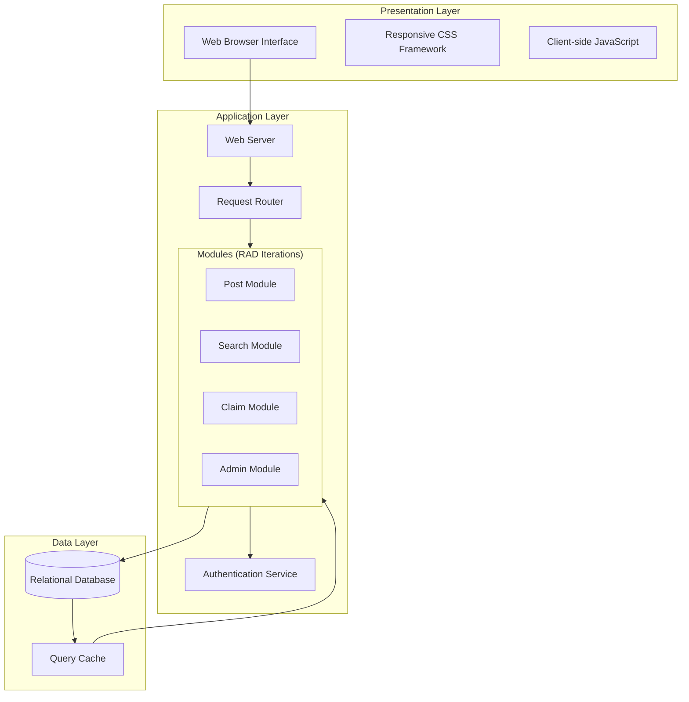
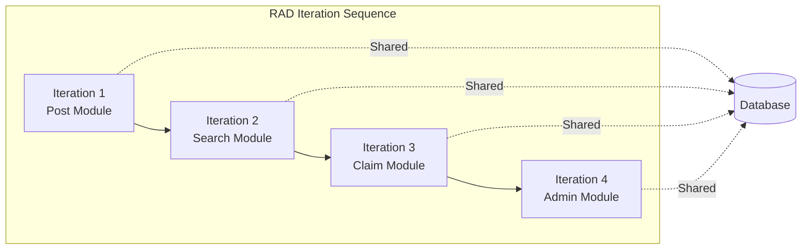
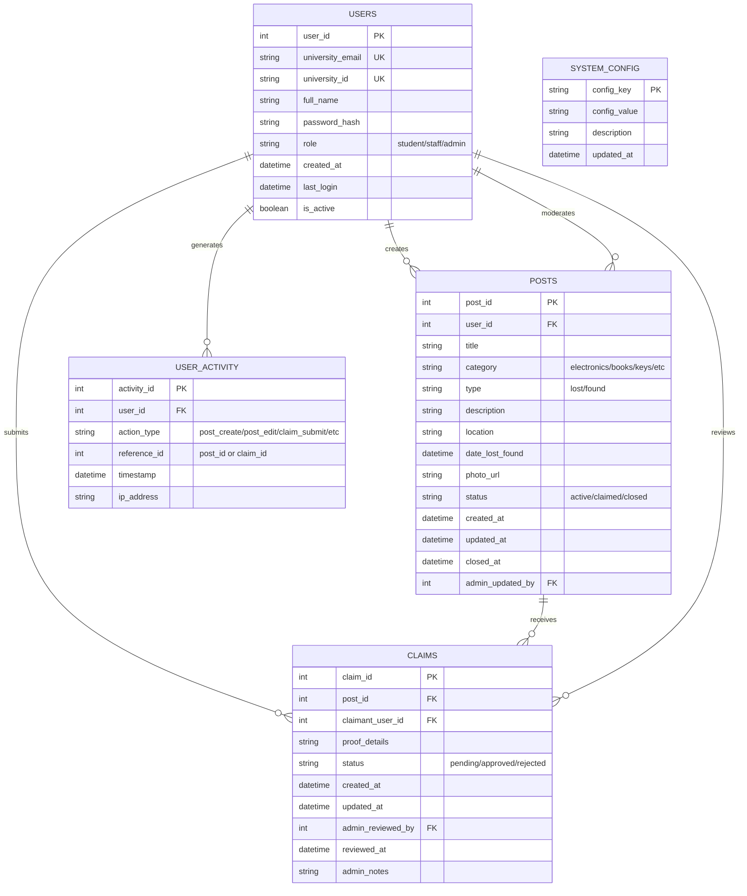
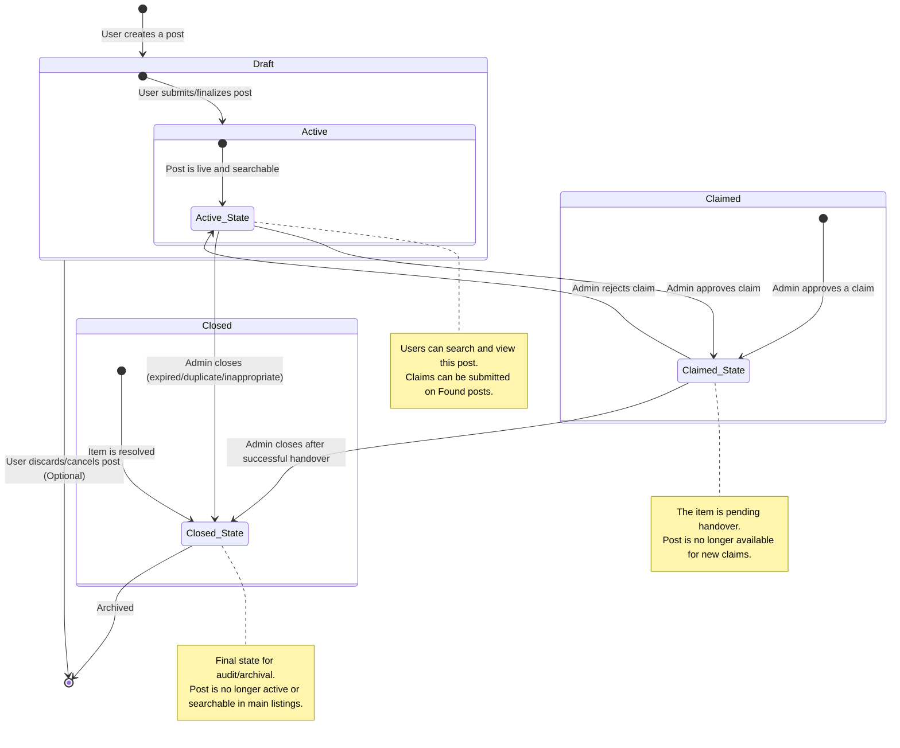
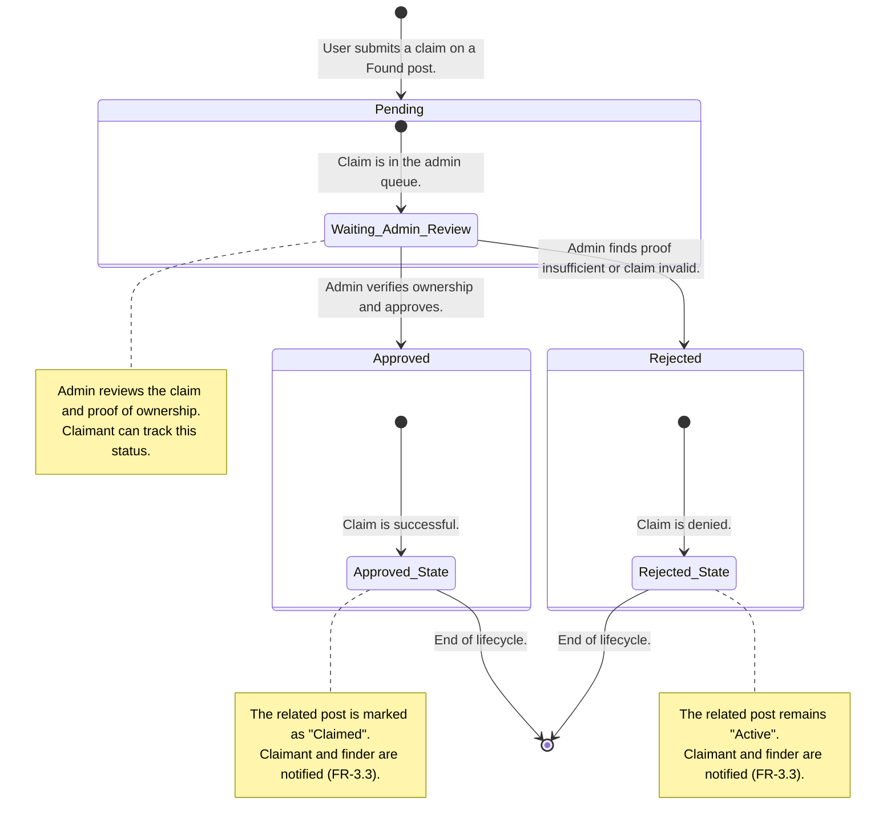
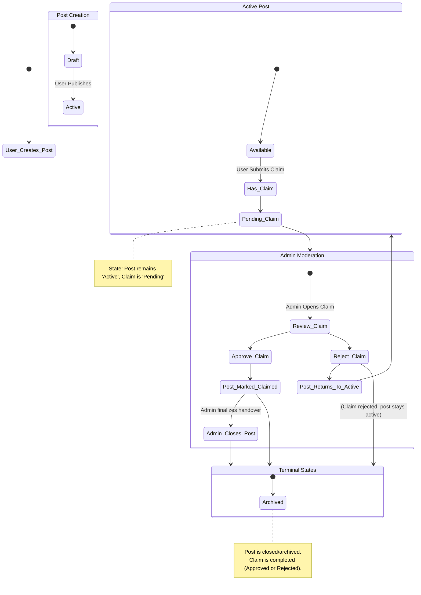
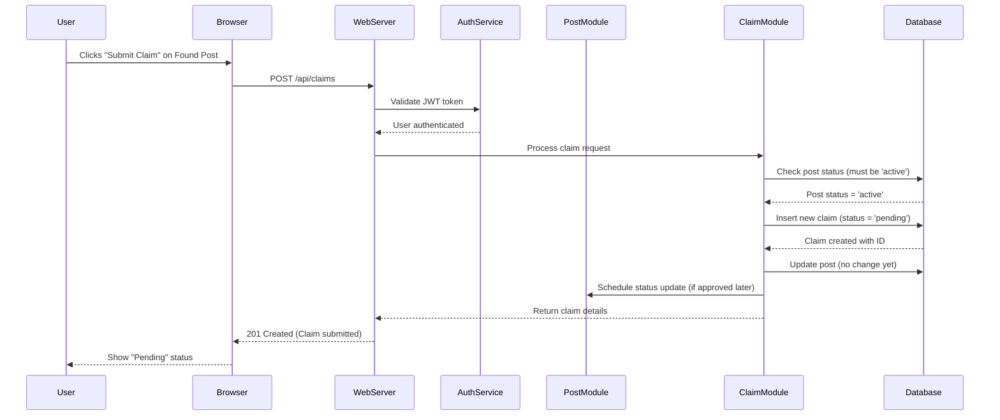
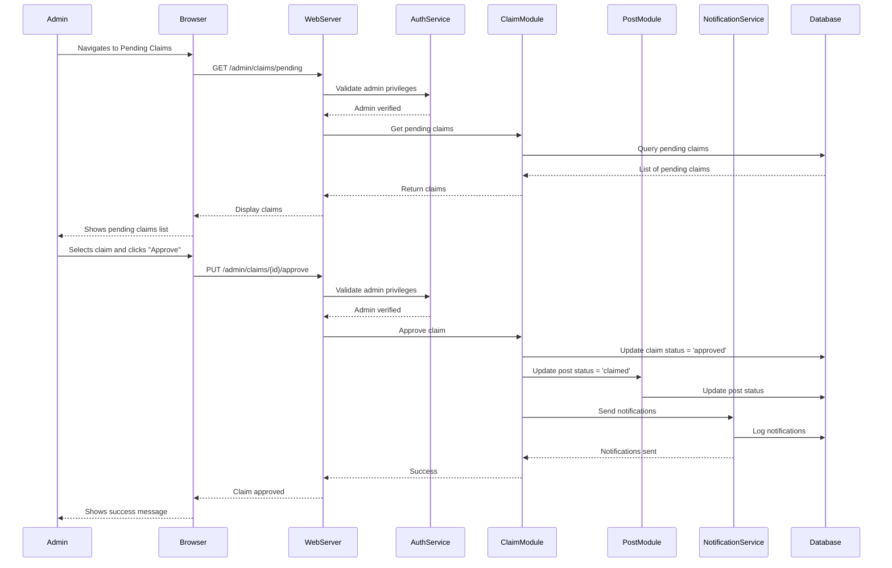

# Architecture Documentation
## Campus Lost & Found Portal

**Version:** 1.0
**Development Model:** Rapid Application Development (RAD)

---

## 1. System Architecture Overview

The Campus Lost & Found Portal follows a standard three-tier web application architecture, designed to support the RAD model's emphasis on modular, independent components.

### 1.1 Architecture Layers

## 1.2 Module Dependencies

## 2. Database Design

### 2.1 Entity Relationship Diagram

### 2.2 Key Relationships
Users to Posts (1:M): One user can create many posts

Users to Claims (1:M): One user can submit many claims

Posts to Claims (1:M): One found post can receive many claims

Admin Users: Can moderate posts and review claims (self-referencing foreign keys)

## 3. State Transitions

### 3.1 Post Lifecycle

## 3.2 Claim Lifecycle

## 3.3 Combined User & Admin Action Flow

## 4. API Flow Diagrams
   
### 4.1 Claim Submission Flow

### 4.2 Admin Claim Review Flow

