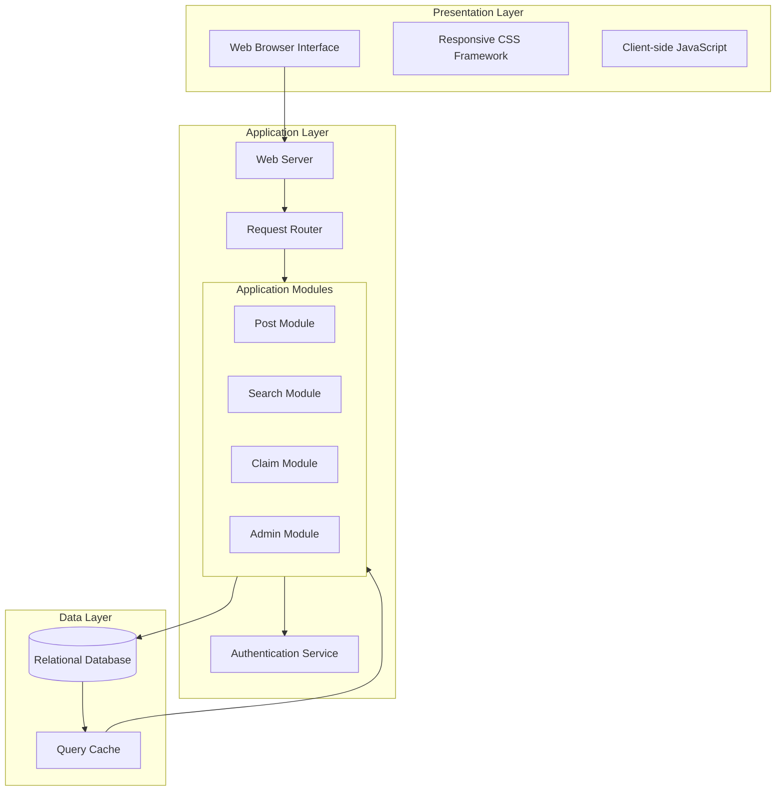

# System Architecture Overview

The Campus Lost & Found Portal follows a three-tier web application architecture consisting of the presentation layer, application layer, and data layer.

```mermaid
flowchart TB
    subgraph Client["Presentation Layer"]
        UI[Web Browser Interface]
        CSS[Responsive CSS Framework]
        JS[Client-side JavaScript]
    end

    subgraph Server["Application Layer"]
        WebServer[Web Server]
        Router[Request Router]
        subgraph Modules["Application Modules"]
            PostModule[Post Module]
            SearchModule[Search Module]
            ClaimModule[Claim Module]
            AdminModule[Admin Module]
        end
        AuthService[Authentication Service]
    end

    subgraph Data["Data Layer"]
        DB[(Relational Database)]
        Cache[Query Cache]
    end

    UI --> WebServer
    WebServer --> Router
    Router --> Modules
    Modules --> AuthService
    Modules --> DB
    DB --> Cache
    Cache --> Modules
```
