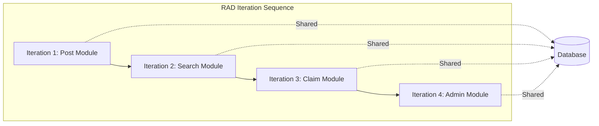

# Module Dependencies

The diagram illustrates the relationship between the major application modules and their shared database across development iterations.

```mermaid
flowchart LR
    subgraph RAD_Iterations["RAD Iteration Sequence"]
        direction LR
        Iter1["Iteration 1: Post Module"]
        Iter2["Iteration 2: Search Module"]
        Iter3["Iteration 3: Claim Module"]
        Iter4["Iteration 4: Admin Module"]
    end

    Iter1 --> Iter2
    Iter2 --> Iter3
    Iter3 --> Iter4

    Iter1 -.->|Shared| DB[(Database)]
    Iter2 -.->|Shared| DB
    Iter3 -.->|Shared| DB
    Iter4 -.->|Shared| DB
```
