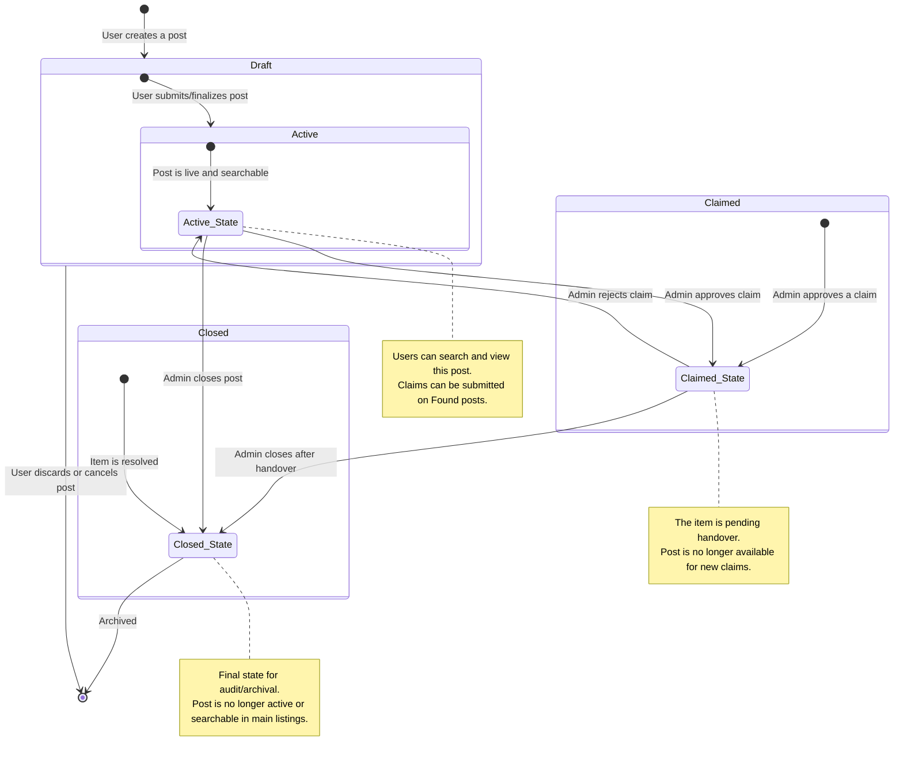

# Post Lifecycle

This diagram illustrates the possible states of a lost or found item post, from creation to closure.

```mermaid
stateDiagram-v2
    [*] --> Draft: User creates a post

    state Draft {
        [*] --> Active: User submits/finalizes post
    }

    state Active {
        [*] --> Active_State: Post is live and searchable
        note right of Active_State
            Users can search and view this post.
            Claims can be submitted on Found posts.
        end note
    }

    state Claimed {
        [*] --> Claimed_State: Admin approves a claim
        note right of Claimed_State
            The item is pending handover.
            Post is no longer available for new claims.
        end note
    }

    state Closed {
        [*] --> Closed_State: Item is resolved
        note right of Closed_State
            Final state for audit/archival.
            Post is no longer active or searchable in main listings.
        end note
    }

    Active_State --> Claimed_State: Admin approves claim
    Active_State --> Closed_State: Admin closes post
    Claimed_State --> Closed_State: Admin closes after handover
    Claimed_State --> Active_State: Admin rejects claim

    Closed_State --> [*]: Archived
    Draft --> [*]: User discards or cancels post
```
