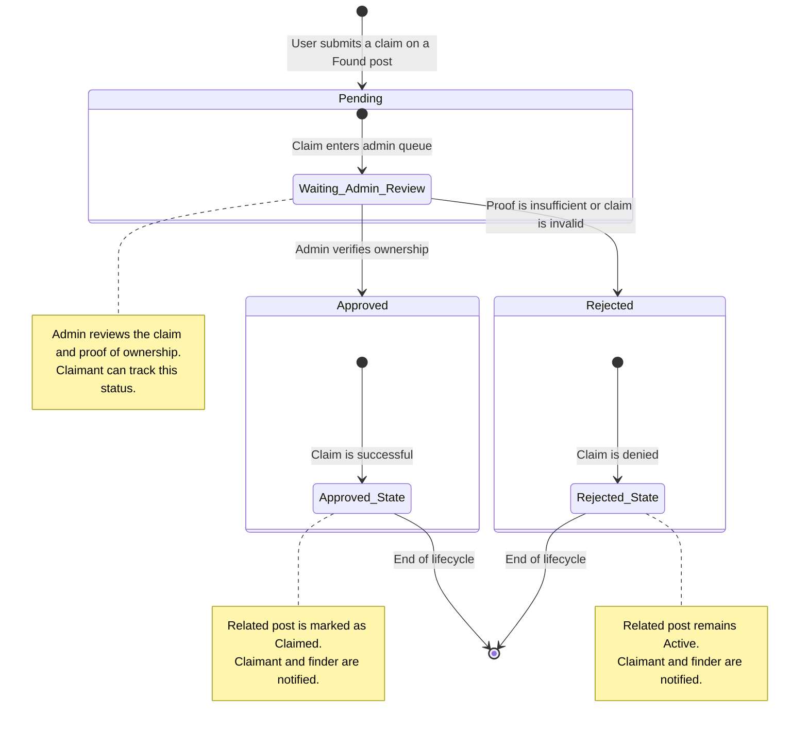

# Claim Lifecycle

This diagram shows the stages of a claim request, from submission to approval or rejection.

```mermaid
stateDiagram-v2
    [*] --> Pending: User submits a claim on a Found post

    state Pending {
        [*] --> Waiting_Admin_Review: Claim enters admin queue
        note right of Waiting_Admin_Review
            Admin reviews the claim and proof of ownership.
            Claimant can track this status.
        end note
    }

    Waiting_Admin_Review --> Approved: Admin verifies ownership
    Waiting_Admin_Review --> Rejected: Proof is insufficient or claim is invalid

    state Approved {
        [*] --> Approved_State: Claim is successful
        note right of Approved_State
            Related post is marked as Claimed.
            Claimant and finder are notified.
        end note
    }

    state Rejected {
        [*] --> Rejected_State: Claim is denied
        note right of Rejected_State
            Related post remains Active.
            Claimant and finder are notified.
        end note
    }

    Approved_State --> [*]: End of lifecycle
    Rejected_State --> [*]: End of lifecycle
```
