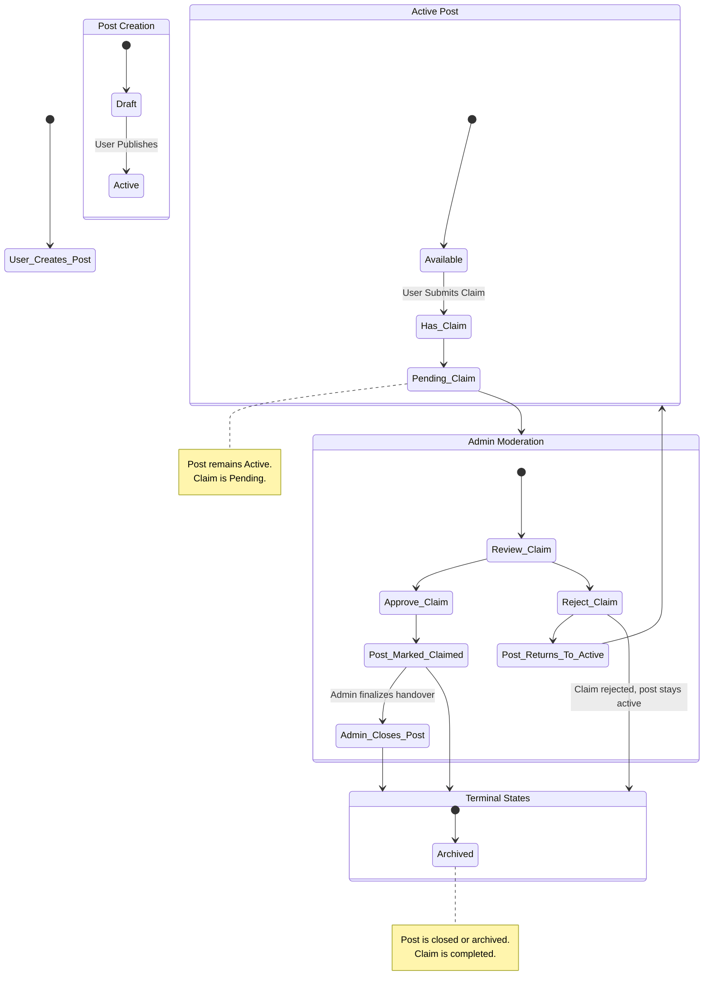

# Combined User and Admin Action Flow

This diagram shows how users create posts and submit claims, and how administrators review claims and update post statuses.

```mermaid
stateDiagram-v2
    [*] --> User_Creates_Post

    state "Post Creation" as PC {
        [*] --> Draft
        Draft --> Active: User Publishes
    }

    state "Active Post" as AP {
        [*] --> Available
        Available --> Has_Claim: User Submits Claim
        Has_Claim --> Pending_Claim
        note right of Pending_Claim
            Post remains Active.
            Claim is Pending.
        end note
    }

    state "Admin Moderation" as AM {
        [*] --> Review_Claim
        Review_Claim --> Approve_Claim
        Review_Claim --> Reject_Claim
        Reject_Claim --> Post_Returns_To_Active

        Approve_Claim --> Post_Marked_Claimed
        Post_Marked_Claimed --> Admin_Closes_Post: Admin finalizes handover
    }

    state "Terminal States" as TS {
        [*] --> Archived
        note right of Archived
            Post is closed or archived.
            Claim is completed.
        end note
    }

    Pending_Claim --> AM
    Post_Returns_To_Active --> AP
    Post_Marked_Claimed --> TS
    Admin_Closes_Post --> TS
    Reject_Claim --> TS: Claim rejected, post stays active
```
