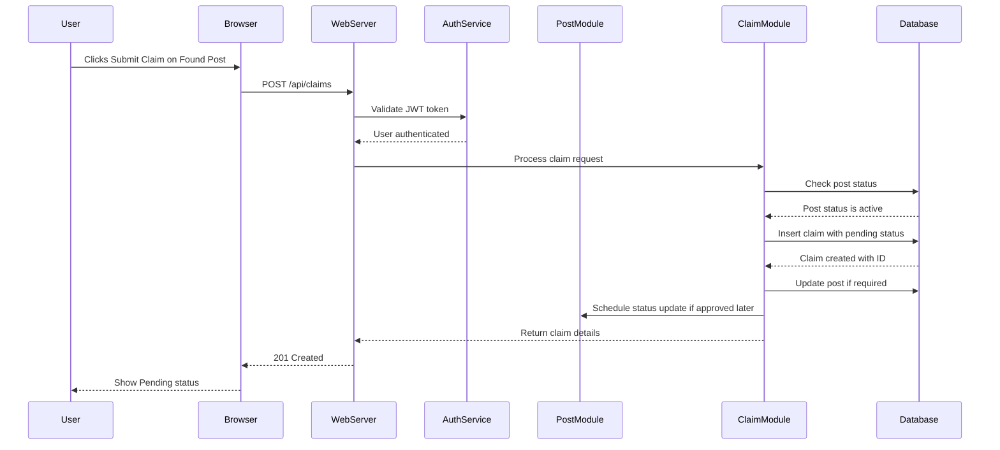

# Claim Submission Flow

This sequence diagram illustrates the interaction between a user, browser, application components, authentication service, and database when a claim is submitted.

```mermaid
sequenceDiagram
    participant User
    participant Browser
    participant WebServer
    participant AuthService
    participant PostModule
    participant ClaimModule
    participant Database

    User->>Browser: Clicks Submit Claim on Found Post
    Browser->>WebServer: POST /api/claims
    WebServer->>AuthService: Validate JWT token
    AuthService-->>WebServer: User authenticated
    WebServer->>ClaimModule: Process claim request

    ClaimModule->>Database: Check post status
    Database-->>ClaimModule: Post status is active

    ClaimModule->>Database: Insert claim with pending status
    Database-->>ClaimModule: Claim created with ID

    ClaimModule->>Database: Update post if required
    ClaimModule->>PostModule: Schedule status update if approved later

    ClaimModule-->>WebServer: Return claim details
    WebServer-->>Browser: 201 Created
    Browser-->>User: Show Pending status
```
