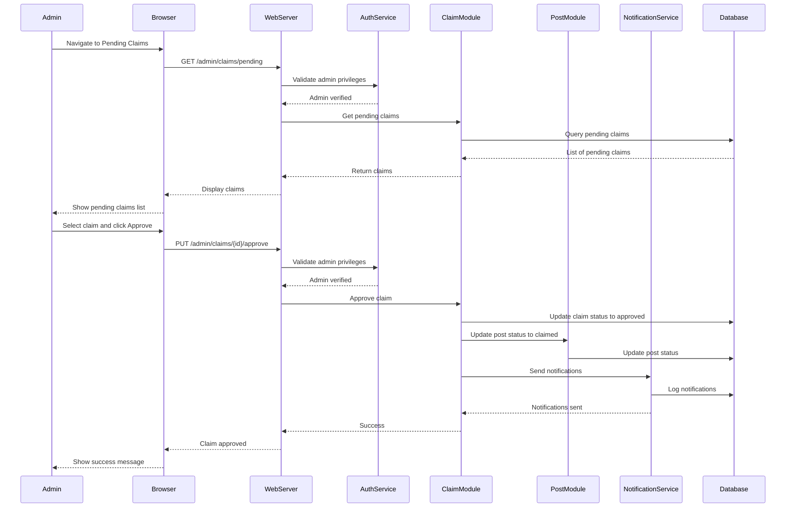

# Admin Claim Review Flow

This diagram describes how an administrator retrieves pending claims, reviews ownership evidence, approves or rejects a claim, and triggers related updates.

```mermaid
sequenceDiagram
    participant Admin
    participant Browser
    participant WebServer
    participant AuthService
    participant ClaimModule
    participant PostModule
    participant NotificationService
    participant Database

    Admin->>Browser: Navigate to Pending Claims
    Browser->>WebServer: GET /admin/claims/pending
    WebServer->>AuthService: Validate admin privileges
    AuthService-->>WebServer: Admin verified

    WebServer->>ClaimModule: Get pending claims
    ClaimModule->>Database: Query pending claims
    Database-->>ClaimModule: List of pending claims
    ClaimModule-->>WebServer: Return claims
    WebServer-->>Browser: Display claims
    Browser-->>Admin: Show pending claims list

    Admin->>Browser: Select claim and click Approve
    Browser->>WebServer: PUT /admin/claims/{id}/approve
    WebServer->>AuthService: Validate admin privileges
    AuthService-->>WebServer: Admin verified

    WebServer->>ClaimModule: Approve claim
    ClaimModule->>Database: Update claim status to approved

    ClaimModule->>PostModule: Update post status to claimed
    PostModule->>Database: Update post status

    ClaimModule->>NotificationService: Send notifications
    NotificationService->>Database: Log notifications

    NotificationService-->>ClaimModule: Notifications sent
    ClaimModule-->>WebServer: Success
    WebServer-->>Browser: Claim approved
    Browser-->>Admin: Show success message
```
