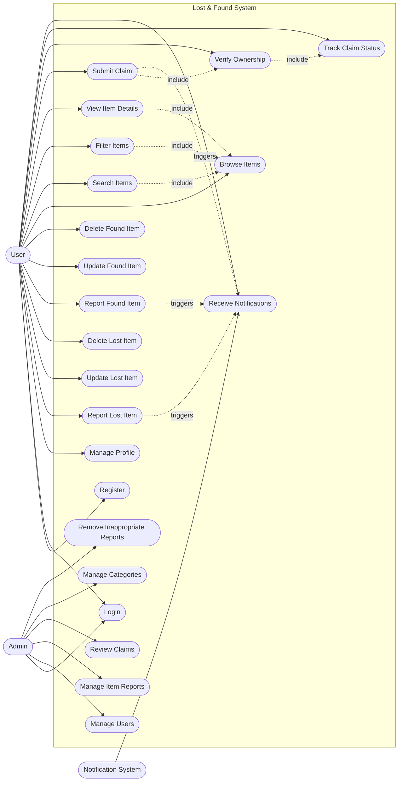

# Use Case Diagram

This diagram represents the main interactions between users, administrators, and the Campus Lost & Found Portal.

```mermaid
flowchart LR
    User([User])
    Admin([Admin])
    Notification([Notification System])

    subgraph LFS["Lost & Found System"]
        UC1([Register])
        UC2([Login])
        UC3([Manage Profile])

        UC4([Report Lost Item])
        UC5([Update Lost Item])
        UC6([Delete Lost Item])

        UC7([Report Found Item])
        UC8([Update Found Item])
        UC9([Delete Found Item])

        UC10([Browse Items])
        UC11([Search Items])
        UC12([Filter Items])
        UC13([View Item Details])

        UC14([Submit Claim])
        UC15([Verify Ownership])
        UC16([Track Claim Status])

        UC17([Receive Notifications])

        UC18([Manage Users])
        UC19([Manage Item Reports])
        UC20([Review Claims])
        UC21([Manage Categories])
        UC22([Remove Inappropriate Reports])
    end

    User --> UC1
    User --> UC2
    User --> UC3
    User --> UC4
    User --> UC5
    User --> UC6
    User --> UC7
    User --> UC8
    User --> UC9
    User --> UC10
    User --> UC11
    User --> UC12
    User --> UC13
    User --> UC14
    User --> UC15
    User --> UC16
    User --> UC17

    Admin --> UC2
    Admin --> UC18
    Admin --> UC19
    Admin --> UC20
    Admin --> UC21
    Admin --> UC22

    Notification --> UC17

    UC11 -.->|include| UC10
    UC12 -.->|include| UC10
    UC13 -.->|include| UC10

    UC14 -.->|include| UC15
    UC15 -.->|include| UC16

    UC4 -.->|triggers| UC17
    UC7 -.->|triggers| UC17
    UC14 -.->|triggers| UC17
```
