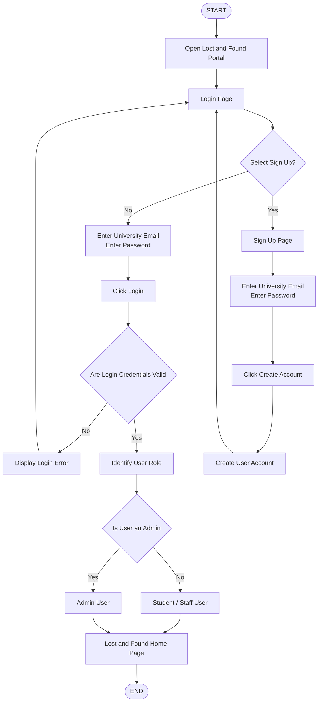
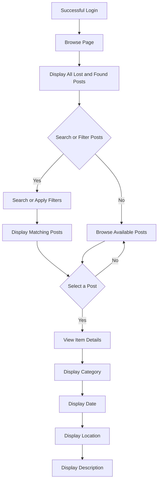
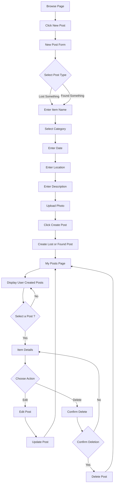

## User Journey Flows

### User Registration & Authentication

```mermaid
flowchart TD

    A([START]) --> B[Open Lost and Found Portal]
    B --> C[Login Page]

    C --> D{Select Sign Up?}

    D -->|No| E[Enter University Email
         Enter Password]
    E --> F[Click Login]
    F --> G{Are Login Credentials Valid}
 
    G -->|No| H[Display Login Error]
    H --> C

    G -->|Yes| I[Identify User Role]
    I --> J{Is User an Admin}

    J -->|No| K[Student / Staff User]
    J -->|Yes| L[Admin User]

    K --> M[Lost and Found Home Page]
    L --> M

    D -->|Yes| N[Sign Up Page]
    N --> O[Enter University Email
         Enter Password]
    O --> P[Click Create Account]
    P --> Q[Create User Account]
    Q --> C

    M --> S([END])
```
 

### Browse, Search, Filter & View Post Details

```mermaid
flowchart TD

    A[Successful Login] --> B[Browse Page]

    B --> C[Display All Lost and Found Posts]

    C --> D{Search or Filter Posts}

    D -->|No| E[Browse Available Posts]

    D -->|Yes| F[Search or Apply Filters]

    F --> G[Display Matching Posts]

    G --> H{Select a Post}

    E --> H

    H -->|Yes| I[View Item Details]

    I --> J[Display Category]
    J --> K[Display Date]
    K --> L[Display Location]
    L --> M[Display Description]

    H -->|No| E
```
 

### Create and Manage Posts

```mermaid
flowchart TD

    A[Browse Page] --> B[Click New Post]

    B --> C[New Post Form]

    C --> D{Select Post Type}

    D -->|Lost Something| E[Enter Item Name]
    D -->|Found Something| E

    E --> F[Select Category]
    F --> G[Enter Date]
    G --> H[Enter Location]
    H --> I[Enter Description]
    I --> J[Upload Photo]

    J --> K[Click Create Post]
    K --> L[Create Lost or Found Post]

    L --> M[My Posts Page]
    M --> N[Display User Created Posts]

    N --> O{Select a Post ?}

    O -->|Yes| P[Item Details]

    P --> Q{Choose Action}

    Q -->|Edit| R[Edit Post]
    R --> S[Update Post]
    S --> M

    Q -->|Delete| T[Confirm Delete]
    T --> U{Confirm Deletion}

    U -->|No| P
    U -->|Yes| V[Delete Post]
    V --> M

    O -->|No| N
```

