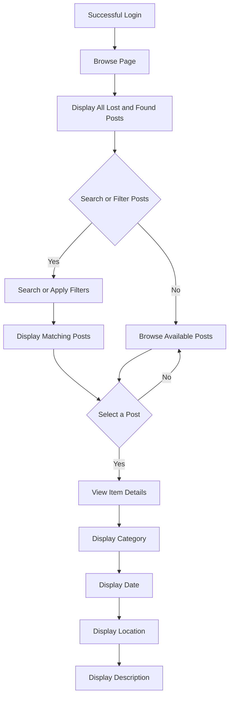
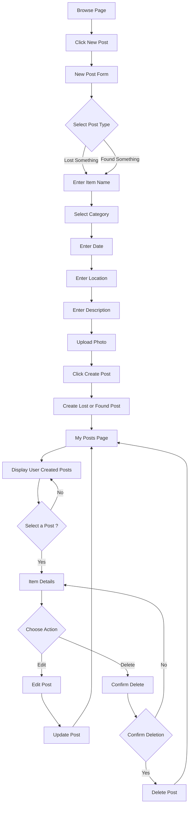
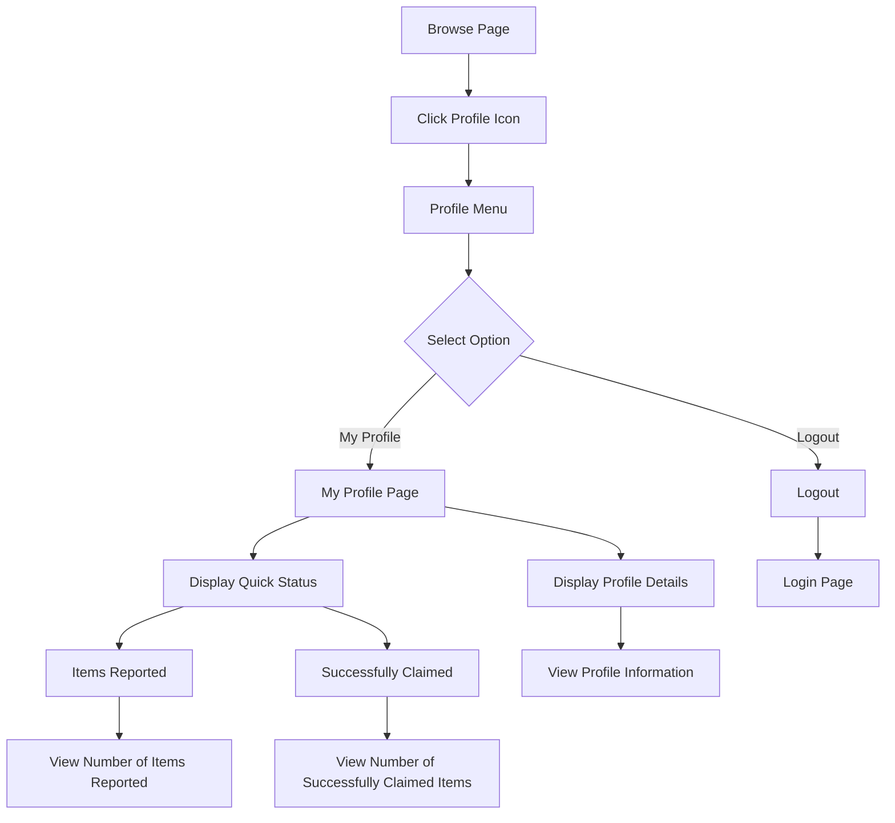

## User Journey Flows

### User Registration & Authentication


<br>

### Browse, Search, Filter & View Post Details


<br>

### Create and Manage Posts


<br>

### Student/Staff Profile Management


<br>

### Admin Profile

```mermaid
flowchart TD

    A[Browse Page] --> B[Click Profile Icon]

    B --> C[Profile Menu]

    C --> D{Select Option}

    D -->|My Profile| E[My Profile Page]
    D -->|Admin Portal| F[Admin Dashboard]
    D -->|Logout| G[Logout]

    E --> H[Display Profile Details]

    F --> I[Display Dashboard Statistics]

    I --> J[Active Posts]
    I --> K[Pending Claims]
    I --> L[Resolved Cases]

    F --> M[Claim Requests Awaiting Verification]

    M --> N[View Claim Request Details]

    N --> O{Approve Claim?}

    O -->|Yes| P[Approve Claim Request]
    O -->|No| Q[Reject Claim Request]

    P --> R[Update Claim Status to Approved]
    Q --> S[Update Claim Status to Rejected]

    R --> T[Update Post Status]
    S --> U[Notify Claimant]

    T --> V[Notify Claimant]
    V --> W[Admin Dashboard]

    U --> W

    G --> X[Login Page]
